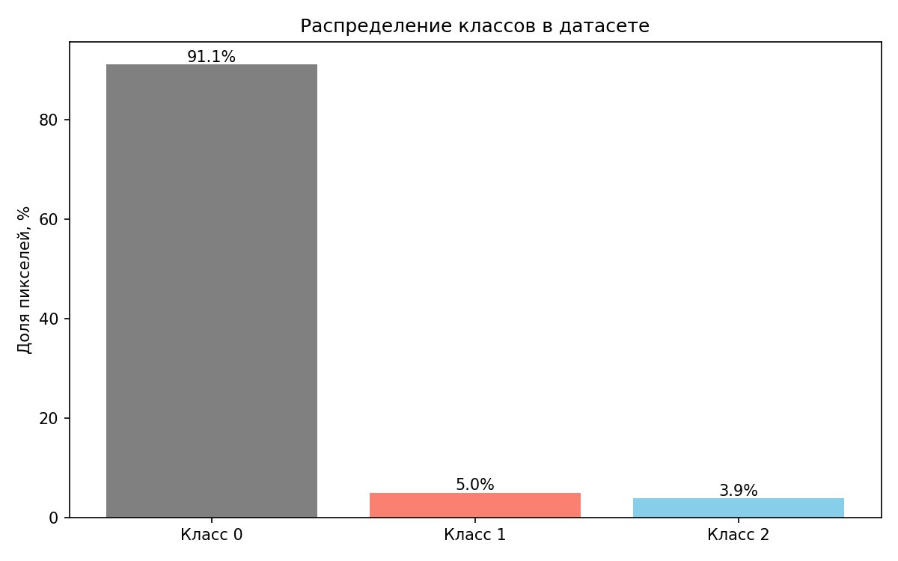
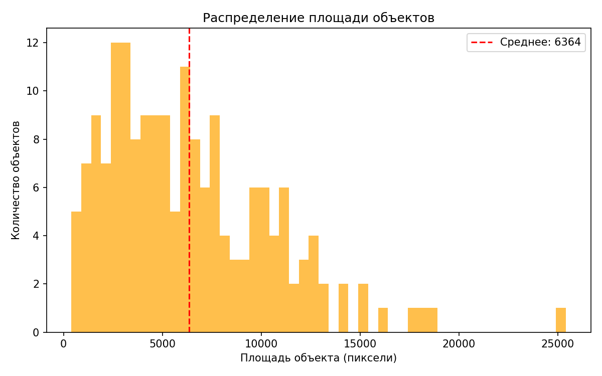
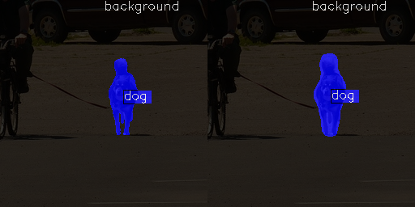
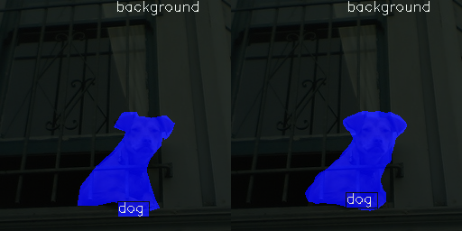
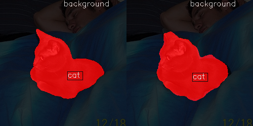
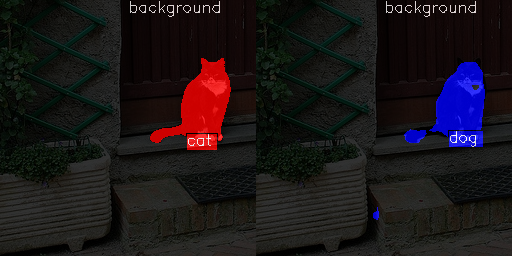
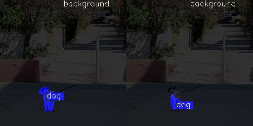

## Этап 1. Исследовательский анализ (EDA)

### Анализ качества данных

Датасет содержит изображения с кошками и собаками. При первичном анализе были обнаружены следующие проблемы:

1. **Проблемы с разметкой и данными**:  
    В данных имеются следующие проблемы:
    - изображения с сильным размытием; 
    - изображения в которых не понятно где объект, а где фон; 
    - данные с некорректной разметкой. 

2. **Стратегия очистки**:  
    Все изображения для обучения были заново размечены с помощью CVAT. 

   Пример до/после переразметке:  
   
   

---

### EDA

Проведённый анализ показал:

- **Количество классов**: 3 (фон = 0, кошка = 1, собака = 2). 
- **Распределение площади объектов** 
- **Размеры изображений**: 256×256 — единообразны.

# Этап 2. Формирование первичных гипотез

В рамках данного этапа были сформулированы и проверены две стартовые гипотезы на основе анализа данных (EDA), специфики задачи (мультиклассовая сегментация с небольшим объёмом данных) и рекомендаций из документации mmsegmentation.

---

## Стартовая гипотеза

### Описание гипотезы

**Выбор модели**:  
Использована архитектура **UNet** (`fcn_unet_s5-d16`) с auxiliary head. UNet — классическая модель, эффективно работает на изображениях небольшого разрешения (256×256) и хорошо подходит для задач с дефицитом данных благодаря симметричной энкодер-декодерной структуре и skip-connections.

**Выбор лосса**:  
Использована стандартная `CrossEntropyLoss` без модификаций. Для задачи с тремя классами (фон, кот, собака).

**Гиперпараметры обучения**:  
- Optimizer: SGD с `lr=0.01`, `momentum=0.9`, `weight_decay=0.0005` — стандартные настройки для сегментации в mmsegmentation.  
- Scheduler: `PolyLR` с `power=0.9`, `eta_min=1e-4`, обучение на 20 эпох — достаточное количество для базовой сходимости.  
- Batch size: 4.

**Аугментации**:  
Отсутствуют. Гипотеза проверяет базовое качество модели без расширения данных — это создаёт «чистый» baseline для последующих экспериментов.

**Обоснование**:  
Данная конфигурация соответствует каноническому baseline в mmsegmentation и позволяет оценить «сырую» способность модели решать задачу на имеющихся данных.

### Результаты обучения

- **Конфиг**: [`Config`](pract_work/configs/unet_catdog_sanity.py)
- **ClearML**: [`ClearML`](https://app.clear.ml/projects/5f67dda2a85741d5a86020f21d469368/experiments/874b0ee4b2b74c46b6aae7fce0043c40/output/execution)

### Анализ качества

- **Метрики на валидации**:
+------------+-------+-------+
|   Class    |  Dice |  Acc  |
+------------+-------+-------+
| background | 94.84 | 99.66 |
|    cat     |  8.6  |  4.78 |
|    dog     | 18.23 | 11.15 |
+------------+-------+-------+

- **mDice**: 0.406

**Выводы**:
- Модель практически идеально сегментирует фон — это указывает на **сильный дисбаланс классов** и/или **недостаточную репрезентацию объектов**.

# Этап 3. Эксперименты по улучшению качества модели

Целевая метрика: **mDice > 0.75**  
Базовое значение mDice на старте: **0.406**  
Ограничения: 2–4 эксперимента, каждый — с инкрементальным изменением одного аспекта.

## Эксперимент 1: Введение аугментаций

### Гипотеза  
Аугментации помогут модели обобщаться лучше и снизить переобучение даже на небольшом датасете, за счёт расширения эффективного объёма обучающих данных.

### Изменения
- Добавлены аугментации:
  dict(type='RandomFlip', prob=0.5),
- Увеличено количество эпох до 40

### Результаты обучения
- **ClearML**: [`ClearML`](https://app.clear.ml/projects/5f67dda2a85741d5a86020f21d469368/experiments/874b0ee4b2b74c46b6aae7fce0043c40/output/execution)

### Анализ качества

- **Метрики на валидации**:
+------------+-------+-------+
|   Class    |  Dice |  Acc  |
+------------+-------+-------+
| background | 95.32 | 97.29 |
|    cat     | 42.29 | 43.91 |
|    dog     |  0.0  |  0.0  |
+------------+-------+-------+
 
 - **mDice**: 0.459

**Вывод**: Модель перестала определять собак, но лучше стала определять кошек.

## Эксперимент 2: Изменение гиперпараметров

### Гипотеза  
Увеличение начальной скорости обучения (lr) в сочетании с линейным warmup и последующим полиномиальным затуханием, а также введение весов в функцию потерь, пропорциональных обратной частоте классов, позволит модели на ранних этапах обучения эффективно улавливать градиенты от редких классов («cat» и особенно «dog»), преодолевая доминирование фона, вызванное сильным дисбалансом данных. 

### Изменения
param_scheduler = [
    dict(
        type='LinearLR',
        start_factor=1e-6,
        end_factor=1.0,
        begin=0,
        end=500,
        by_epoch=False
    ),
    dict(
        type='PolyLR',
        eta_min=1e-6,  
        power=0.9,
        begin=500,
        end=4800,
        by_epoch=False
    )
]

loss_decode=dict(
        type='CrossEntropyLoss',
        use_sigmoid=False,
        class_weight=[0.1, 1.0, 2.0],
        loss_weight=1.0
    )

Увеличение количества эпох до 50.

### Результаты обучения
- **ClearML**: [`ClearML`](https://app.clear.ml/projects/5f67dda2a85741d5a86020f21d469368/experiments/2e7abf8a6da34afd98ff7470842c4826/output/execution)

### Анализ качества

- **Метрики на валидации**:
+------------+-------+-------+
|   Class    |  Dice |  Acc  |
+------------+-------+-------+
| background | 91.77 |  85.9 |
|    cat     | 43.58 | 61.19 |
|    dog     | 39.38 | 68.21 |
+------------+-------+-------+
 
 - **mDice**: 0.582

**Выводы**: Результаты значительно улучшились, но всем еще не едостаточно.

## Эксперимент 3: Переход к другой модели

### Гипотеза  
Заменить архитектуру на SegFormer-b0, специально разработанную для эффективной работы на изображениях низкого разрешения.

### Изменения
Переход от SGD к AdamW (рекомендовано для трансформеров),
Комбинированный лосс: 0.5 × CrossEntropy + 0.5 × DiceLoss 

### Результаты обучения
- **ClearML**: [`ClearML`](https://app.clear.ml/projects/5f67dda2a85741d5a86020f21d469368/experiments/f63e89cb5fda4a52a858cc24bb2d32a8/output/execution)

### Анализ качества

- **Метрики на валидации**:
+------------+-------+-------+
|   Class    |  Dice |  Acc  |
+------------+-------+-------+
| background | 97.71 | 97.18 |
|    cat     | 77.73 |  85.5 |
|    dog     |  68.1 | 65.37 |
+------------+-------+-------+
 - **mDice**: 0.812

**Выводы**: Метрика достигнута, осталось сохранить ее на тесте.

## Этап 4. Заключение и выбор лучшего эксперимента

### Лучший эксперимент 

Эксперимент №3 с перехордом на модель SegFormer-b0

**mDice (test subset) = 83.6**
+------------+-------+-------+-------+
|   Class    |  Dice |  Acc  |  IoU  |
+------------+-------+-------+-------+
| background | 98.02 | 97.45 | 96.13 |
|    cat     | 79.37 | 81.14 | 65.79 |
|    dog     |  73.5 | 80.04 |  58.1 |
+------------+-------+-------+-------+
pract_work/viz/test/test_000000242526_4464.jpg_1.png

### Примеры корректных предсказаний (тестовый датасет)

### Примеры ошибок (тестовый датасет)

## Этап 5. Документация кода

- Проверка соответствия имён: `pract_work/src/data/check_dataset.py`
- Визуализация по классам (10 изображений): `pract_work/src/data/viz_class.py`
- Визуализация всех изображений и масок для оценки качества: `pract_work/src/data/viz_all.py`
- Визуализация одного изображения и маски: `pract_work/src/data/viz_one.py`
- Построение графиков: `pract_work/src/data/eda_plots.py`
- Конвертация масок после разметки CVAT (RGB --> ID): `pract_work/src/data/convert.py`
